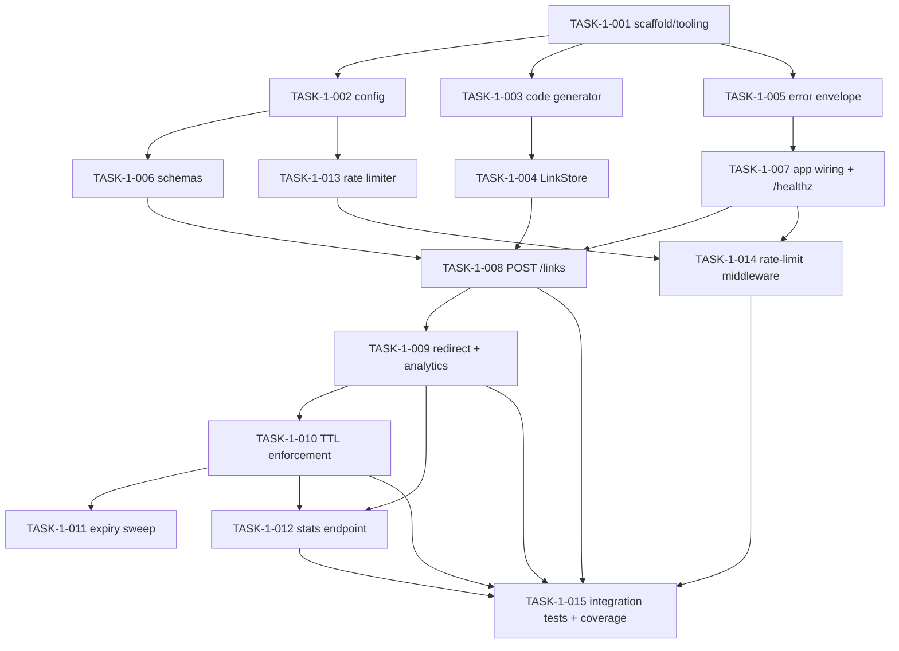

# CYCLE 1 — Task Breakdown

**Linear parent:** SUJ-5 · **Stories:** `specs/cycles/CYCLE_1.md` · **Specs:** `specs/TECH_SPEC.md`

All tasks are **S** (< 1 day). IDs follow `TASK-1-NNN`. "Story" links each task
back to its parent story. "Files" are the likely touch points from TECH_SPEC §1.

## Dependency Graph

---

### TASK-1-001 — Project scaffold and tooling
- **Story:** S1 · **Effort:** S · **Depends on:** none
- **Description:** Create the package layout and `pyproject.toml` with deps
  (fastapi, uvicorn, pydantic, python-dotenv) and `[tool.ruff]`,
  `[tool.pytest.ini_options]` (register `unit`/`integration`/`e2e` marks),
  coverage config.
- **AC:** `ruff check` and `pytest` run on an empty suite; package imports cleanly.
- **Files:** `pyproject.toml`, `src/__init__.py`, `tests/__init__.py`

### TASK-1-002 — Configuration module
- **Story:** S1/S7 · **Effort:** S · **Depends on:** TASK-1-001
- **Description:** Load env config per TECH_SPEC §11: `BASE_URL`, `RATE_LIMIT_MAX`,
  `RATE_LIMIT_WINDOW_SECONDS`, `CODE_LENGTH`, `MAX_URL_LENGTH`, `MAX_TTL_SECONDS`,
  each with the documented default.
- **AC:** Defaults apply when env unset; overrides honored; values typed (int/str).
- **Files:** `src/config.py`, `tests/unit/test_config.py`

### TASK-1-003 — Base62 code generator
- **Story:** S1 · **Effort:** S · **Depends on:** TASK-1-001
- **Description:** Generate `CODE_LENGTH` base62 codes using `secrets`; expose a
  collision-retry contract (caller supplies an "exists?" check; retry up to N,
  else raise).
- **AC:** Code length/alphabet correct; uses `secrets`; retries on collision;
  raises after N exhausted.
- **Files:** `src/codegen.py`, `tests/unit/test_codegen.py`

### TASK-1-004 — LinkRecord and LinkStore
- **Story:** S1 · **Effort:** S · **Depends on:** TASK-1-003
- **Description:** Frozen `LinkRecord` DTO + dict-backed, lock-guarded `LinkStore`
  with `create`, `get`, and a click-increment that updates `clicks`/`last_access`.
- **AC:** Create returns unique code + retrievable record; concurrent increments
  lose no updates; lock guards all mutations.
- **Files:** `src/store.py`, `tests/unit/test_store.py`

### TASK-1-005 — Error envelope and exception handlers
- **Story:** S7 · **Effort:** S · **Depends on:** TASK-1-001
- **Description:** Shared `{ "error": { "code", "message" } }` envelope and FastAPI
  exception handlers mapping to codes in TECH_SPEC §4 (`invalid_request`,
  `not_found`, `expired`, `rate_limited`).
- **AC:** Each error type renders the envelope with the correct `error.code` and
  HTTP status; `422` validation errors are reshaped into the envelope.
- **Files:** `src/errors.py`, `tests/unit/test_errors.py`

### TASK-1-006 — Pydantic schemas
- **Story:** S2 · **Effort:** S · **Depends on:** TASK-1-002
- **Description:** `CreateLinkRequest` (`url: AnyHttpUrl`, optional `expires_in` >0
  and ≤ `MAX_TTL_SECONDS`, `extra="forbid"`, URL length ≤ `MAX_URL_LENGTH`) and
  frozen response models for create/stats.
- **AC:** Valid input parses; non-`http(s)`, over-length, bad `expires_in`, and
  extra fields all reject with validation errors.
- **Files:** `src/schemas.py`, `tests/unit/test_schemas.py`

### TASK-1-007 — App wiring and health endpoint
- **Story:** S7 · **Effort:** S · **Depends on:** TASK-1-005
- **Description:** Construct the FastAPI app, register exception handlers, and add
  `GET /healthz`.
- **AC:** `GET /healthz` → `200 {"status": "ok"}`; app starts; OpenAPI served.
- **Files:** `src/main.py`, `tests/integration/test_health.py`

### TASK-1-008 — Create endpoint (`POST /links`)
- **Story:** S2 · **Effort:** S · **Depends on:** TASK-1-004, TASK-1-006, TASK-1-007
- **Description:** Handler that validates via schema, creates a record, builds
  `short_url` from `BASE_URL`, returns `201`. Sets `expires_at` from `expires_in`.
- **AC:** Valid URL → `201` with full payload; invalid input → `422` envelope.
- **Files:** `src/main.py`

### TASK-1-009 — Redirect endpoint with analytics (`GET /{code}`)
- **Story:** S3 · **Effort:** S · **Depends on:** TASK-1-008
- **Description:** `GET /{code}` → `302` to the long URL; increments `clicks` and
  updates `last_access`; `404` for unknown code.
- **AC:** `302` + `Location` for known code; counter increments atomically; `404`
  for unknown.
- **Files:** `src/main.py`, `src/store.py`

### TASK-1-010 — TTL enforcement
- **Story:** S5 · **Effort:** S · **Depends on:** TASK-1-009
- **Description:** Lazy expiry check on redirect/stats: expired → `410` (`expired`
  envelope). All time in UTC, ISO-8601 `Z`.
- **AC:** Before `expires_at` → `302`; at/after → `410`; no-TTL links never expire;
  boundary flips exactly at `expires_at`.
- **Files:** `src/store.py`, `src/main.py`, `tests/unit/test_expiry.py`

### TASK-1-011 — Background expiry sweep
- **Story:** S5 · **Effort:** S · **Depends on:** TASK-1-010
- **Description:** Periodic task (app lifespan) evicting expired records to bound
  memory; lazy check remains the correctness guarantee.
- **AC:** After sweep, expired records are gone and return `404`; sweep interval
  configurable; no effect on live links.
- **Files:** `src/main.py`, `src/store.py`

### TASK-1-012 — Stats endpoint (`GET /links/{code}/stats`)
- **Story:** S4 · **Effort:** S · **Depends on:** TASK-1-009, TASK-1-010
- **Description:** Return analytics payload per TECH_SPEC §3.3 including `expired`.
- **AC:** `200` with all fields; `clicks` matches redirect count; expired-not-evicted
  → `expired: true`; unknown/evicted → `404`.
- **Files:** `src/main.py`

### TASK-1-013 — Sliding-window rate limiter
- **Story:** S6 · **Effort:** S · **Depends on:** TASK-1-002
- **Description:** Per-IP deque sliding-window limiter (`RATE_LIMIT_MAX` /
  `RATE_LIMIT_WINDOW_SECONDS`); computes allow/deny + seconds-until-free; evicts
  empty deques.
- **AC:** Under limit allows; at limit denies; window roll-off re-allows; empty
  deques evicted.
- **Files:** `src/rate_limit.py`, `tests/unit/test_rate_limit.py`

### TASK-1-014 — Rate-limit middleware on create
- **Story:** S6 · **Effort:** S · **Depends on:** TASK-1-007, TASK-1-013
- **Description:** Wire the limiter to `POST /links` only; on deny return `429`
  with `Retry-After`. Use socket peer IP; do not trust `X-Forwarded-For`.
- **AC:** Over-limit `POST /links` → `429` + `Retry-After`; redirect/stats never
  limited; peer IP used for identity.
- **Files:** `src/main.py`, `src/rate_limit.py`

### TASK-1-015 — Integration tests and coverage gate
- **Story:** all · **Effort:** S · **Depends on:** TASK-1-008, TASK-1-009, TASK-1-010, TASK-1-012, TASK-1-014
- **Description:** TestClient integration suite covering create→redirect→stats,
  `404`/`410`/`422`/`429` paths, and shared fixtures in `conftest.py`. Enforce
  coverage thresholds.
- **AC:** Full-flow and error-path tests pass; ≥80% overall, ≥95% on redirect/TTL/
  rate-limit paths.
- **Files:** `tests/integration/`, `tests/conftest.py`

---

## Summary

15 tasks, all S. Critical path:
`001 → 003 → 004 → 008 → 009 → 010 → 012 → 015`.
Parallelizable early branches: config/schemas (`002→006`), error/health
(`005→007`), and rate limiting (`013→014`).
